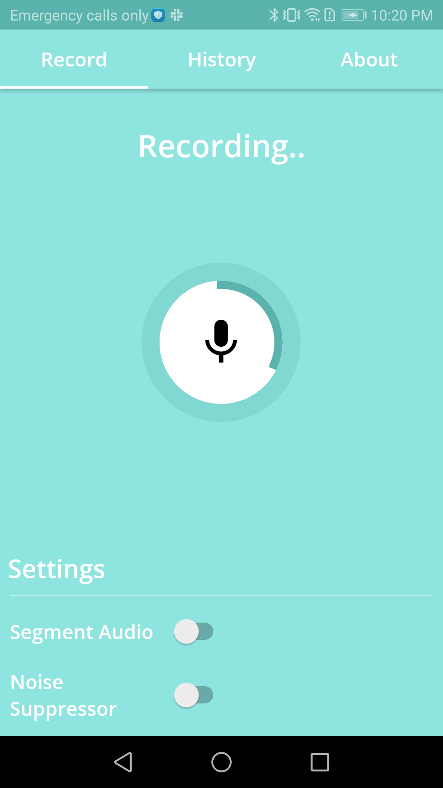
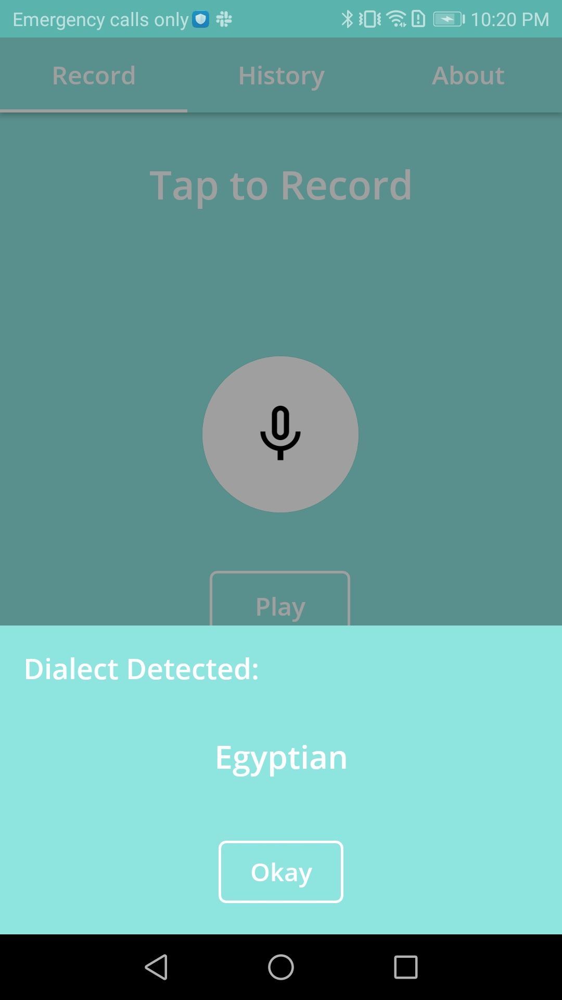
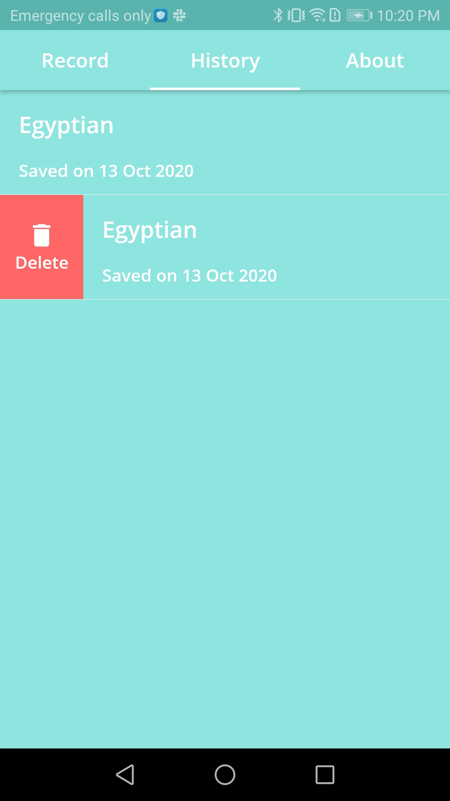
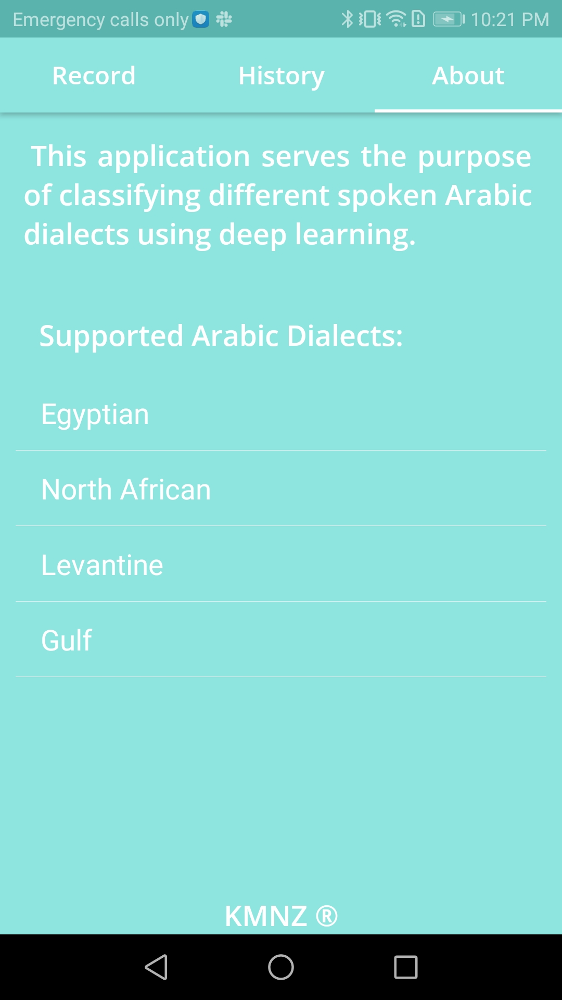

# Lahga
A neural network trained to identify the spoken Arabic dialect deployed on Android and Android Wear. Python, Java.
Main features: Audio recording, history list, tensorflow, custom loading spinner, splashscreen.

Powerpoint presentation [file](https://github.com/karimatwa/Etbara3-Android/blob/master/Etbara3%20Pres.pptx?raw=true).

Software design description [file](https://github.com/nesmabadr/Arabic-Dialect-Identification/blob/master/Software%20Design%20Description.docx?raw=true).

Software requirement specification [file](https://github.com/nesmabadr/Arabic-Dialect-Identification/blob/master/Software%20Requirement%20Specification.docx?raw=true).

<h1 align="center">Screens</h1>

     
      
      
      
     

